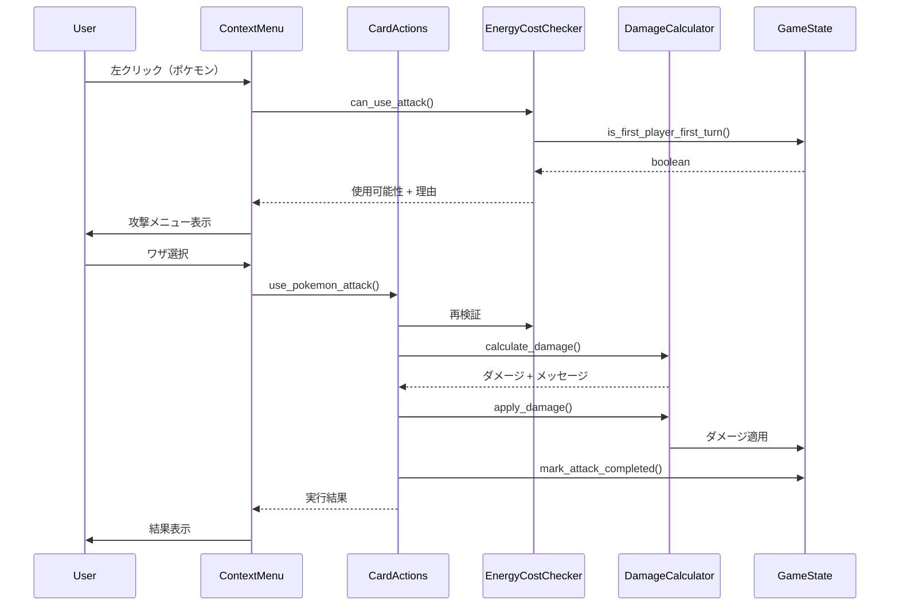
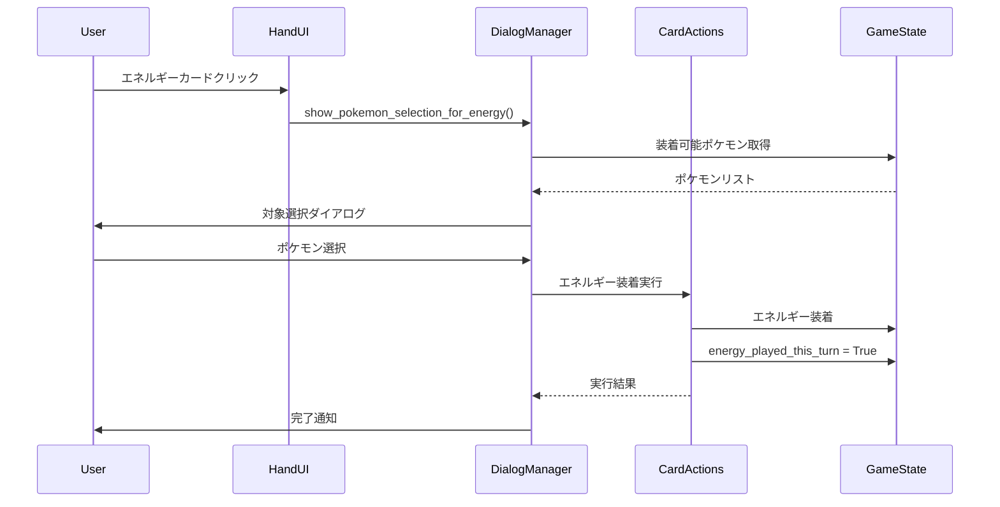
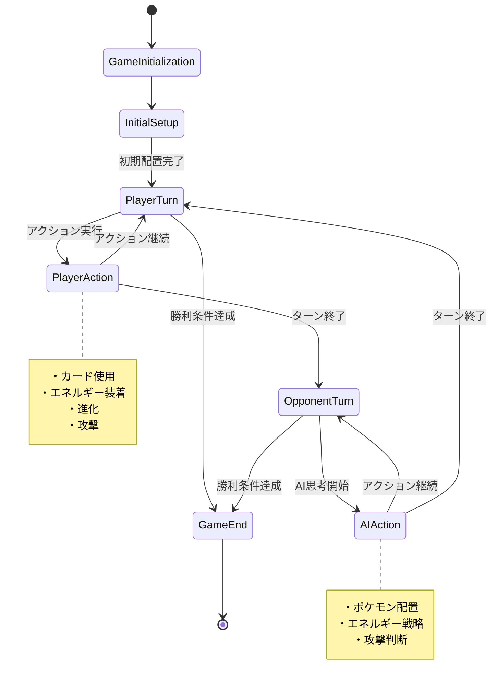

# ポケモンTCGシミュレータ システム設計書

**作成日:** 2025-06-12  
**バージョン:** v4.28実装ベース  
**作成者:** 実装分析による逆設計  

---

## 📋 1. システム概要

### 1.1 アーキテクチャパターン
**Model-View-Controller (MVC) + Observer Pattern**

```
┌─────────────────┐    ┌─────────────────┐    ┌─────────────────┐
│     Models      │    │      Views      │    │   Controllers   │
│                 │    │                 │    │                 │
│ ・card.py       │◄──►│ ・main_gui.py   │◄──►│ ・card_actions  │
│ ・game_state.py │    │ ・battle_field  │    │ ・ai_controller │
│ ・attack_effects│    │ ・hand_ui.py    │    │ ・game_controller│
└─────────────────┘    └─────────────────┘    └─────────────────┘
          ▲                       ▲                       ▲
          │                       │                       │
          └───────────────────────┼───────────────────────┘
                                  ▼
                        ┌─────────────────┐
                        │     Utils       │
                        │                 │
                        │ ・energy_cost   │
                        │ ・damage_calc   │
                        │ ・special_cond  │
                        └─────────────────┘
```

### 1.2 主要設計原則
- **単一責任原則**: 各クラスは明確な責任を持つ
- **開放閉鎖原則**: 拡張に開放、修正に閉鎖
- **依存関係逆転**: 抽象に依存、具象に依存しない
- **コールバック設計**: 疎結合なイベント処理

---

## 🏗️ 2. システム構成

### 2.1 ディレクトリ構造
```
Pokemon TCG Simulator/
├── main.py                           # エントリーポイント (v4.21)
├── models/                           # データモデル層
│   ├── __init__.py                   # (v4.22)
│   ├── card.py                       # カードデータモデル (v4.5)
│   ├── game_state.py                 # ゲーム状態管理 (v4.23)
│   └── attack_effects.py             # 攻撃効果システム (v3.0)
├── gui/                              # ビュー層
│   ├── __init__.py                   # (v4.22)
│   ├── main_gui.py                   # メインGUI (v4.26)
│   ├── battle_field_ui.py            # バトル場UI (v4.23)
│   ├── hand_ui.py                    # 手札UI (v4.7)
│   ├── card_actions.py               # カード操作コントローラー (v4.28)
│   ├── ai_controller.py              # AI制御 (v4.22)
│   ├── game_controller.py            # ゲーム制御 (v4.28)
│   ├── pokemon_context_menu.py       # 統一コンテキストメニュー (v4.23)
│   ├── attack_selection_dialog.py    # ワザ選択ダイアログ (v4.23)
│   ├── deck_selection_dialog.py      # デッキ選択ダイアログ (v4.20)
│   └── dialog_manager.py             # ダイアログ管理 (v4.20)
├── utils/                            # ユーティリティ層
│   ├── __init__.py                   # (v4.22)
│   ├── energy_cost_checker.py        # エネルギーコスト判定 (v2.1)
│   ├── damage_calculator.py          # ダメージ計算 (v2.1)
│   └── special_condition_helper.py   # 特殊状態処理 (v2.0)
├── database/                         # データアクセス層
│   ├── __init__.py                   # (v4.5)
│   └── database_manager.py           # CSV DB管理 (v4.7)
└── cards/                            # データファイル
    ├── cards.csv                     # カードマスターデータ
    └── deck.csv                      # デッキ構成データ
```

---

## 🎯 3. 詳細設計

### 3.1 Modelsレイヤー設計

#### **Card クラス (models/card.py v4.5)**
```python
@dataclass
class Card:
    """カードデータモデル - Immutableな設計"""
    # 基本情報
    id: int
    name: str
    card_type: CardType                    # Enum: POKEMON/TRAINER/ENERGY/TOOL
    
    # ポケモン固有属性
    hp: Optional[int] = None
    pokemon_type: Optional[str] = None
    
    # ワザシステム（複数ワザ対応）
    attack_name: Optional[str] = None
    attack_power: Optional[int] = None
    attack_cost_types: Optional[Dict[str, int]] = None  # エネルギーコスト詳細
    attack_effect: Optional[str] = None
    
    attack2_name: Optional[str] = None      # ワザ2対応
    attack2_power: Optional[int] = None
    attack2_cost_types: Optional[Dict[str, int]] = None
    attack2_effect: Optional[str] = None
    
    # バトル属性
    weakness: Optional[str] = None
    resistance: Optional[str] = None
    retreat_cost: Optional[int] = None
    
    # 進化システム
    evolve_step: int = 0                   # 0=基本, 1=1進化, 2=2進化
    evolves_from: Optional[str] = None
    
    # 動的状態（ゲーム中に変化）
    damage_taken: int = 0
    attached_energy: List['Card'] = field(default_factory=list)
    special_conditions: Set[SpecialCondition] = field(default_factory=set)
    summoned_this_turn: bool = False       # 進化制限管理用
```

**設計ポイント:**
- **Dataclass使用**: ボイラープレート削減
- **型ヒント完備**: 静的解析対応
- **不変性の一部採用**: 基本属性は変更不可
- **状態分離**: 静的データと動的状態の明確な分離

#### **GameState クラス (models/game_state.py v4.23)**
```python
class GameState:
    """ゲーム状態管理 - State Pattern + Observer Pattern"""
    
    def __init__(self):
        # フィールド管理
        self.player_hand: List[Card] = []
        self.opponent_hand: List[Card] = []
        self.player_bench: List[Optional[Card]] = [None] * 5
        self.opponent_bench: List[Optional[Card]] = [None] * 5
        self.player_active: Optional[Card] = None
        self.opponent_active: Optional[Card] = None
        
        # ゲーム進行管理
        self.turn_count: int = 0
        self.current_player: str = "player"
        self.first_player: Optional[str] = None    # v4.23: 先攻制限対応
        
        # ターン制限管理
        self.energy_played_this_turn: bool = False
        self.supporter_played_this_turn: bool = False
        self.player_has_attacked: bool = False     # v4.23: 攻撃制限強化
        self.opponent_has_attacked: bool = False
    
    def is_first_player_first_turn(self) -> bool:
        """先攻1ターン目判定 - 公式ルール準拠"""
        return (
            self.turn_count == 1 and 
            self.current_player == self.first_player and
            self.first_player is not None
        )
    
    def can_evolve_pokemon(self, pokemon: Card) -> bool:
        """進化可能性判定 - v4.28修正版"""
        if not self.initialization_complete:
            return False
        
        # 最初の自分の番では進化不可
        if self.is_current_player_first_turn():
            return False
        
        # そのターンに出されたポケモンは進化不可
        if getattr(pokemon, 'summoned_this_turn', False):
            return False
        
        return True
```

**設計ポイント:**
- **状態パターン**: ゲーム状態による動作変更
- **制約チェック**: ルールベースの事前条件検証
- **フラグ管理**: ターン制限・進化制限の厳密な管理
- **デバッグ支援**: 状態可視化メソッド搭載

### 3.2 Utilsレイヤー設計

#### **EnergyCostChecker (utils/energy_cost_checker.py v2.1)**
```python
class EnergyCostChecker:
    """エネルギーコスト判定 - Strategy Pattern"""
    
    @staticmethod
    def can_use_attack(pokemon: Card, attack_number: int = 1, 
                      game_state=None) -> Tuple[bool, str]:
        """ワザ使用可能性の総合判定"""
        # 1. 先攻1ターン目制限チェック
        if game_state and game_state.is_first_player_first_turn():
            return False, "先攻プレイヤーの最初のターンは攻撃できません"
        
        # 2. ワザ存在チェック
        if not self._get_attack_info(pokemon, attack_number):
            return False, "ワザが設定されていません"
        
        # 3. エネルギーコスト判定（無色エネルギー対応）
        return self._check_energy_cost_with_colorless(
            cost_types, attached_energy, attack_name
        )
    
    @staticmethod
    def _check_energy_cost_with_colorless(cost_types: Dict[str, int], 
                                         attached_energy: Dict[str, int]) -> Tuple[bool, str]:
        """無色エネルギー対応コスト判定"""
        # 特定タイプエネルギー要求を優先チェック
        used_for_specific = 0
        for energy_type, required_count in cost_types.items():
            if energy_type not in ['無色', 'colorless']:
                available = attached_energy.get(energy_type, 0)
                if available < required_count:
                    return False, f"{energy_type}エネルギーが{required_count - available}個不足"
                used_for_specific += required_count
        
        # 無色エネルギー要求を残りエネルギーで判定
        colorless_required = cost_types.get('無色', 0)
        remaining_energy = attached_energy.get('total', 0) - used_for_specific
        
        if remaining_energy < colorless_required:
            return False, f"無色エネルギーが{colorless_required - remaining_energy}個不足"
        
        return True, "使用可能"
```

**設計ポイント:**
- **ストラテジーパターン**: アルゴリズムの分離
- **無色エネルギー対応**: 複雑な支払いルールの実装
- **先攻制限統合**: ゲーム状態との連携
- **詳細エラー**: 具体的な不足理由の提供

#### **DamageCalculator (utils/damage_calculator.py v2.1)**
```python
class DamageCalculator:
    """ダメージ計算システム - Chain of Responsibility Pattern"""
    
    @staticmethod
    def calculate_damage(attacker: Card, defender: Card, 
                        attack_number: int) -> Tuple[int, List[str]]:
        """ダメージ計算チェーン"""
        messages = []
        
        # 1. 基本ダメージ取得
        base_damage = self._get_base_damage(attacker, attack_number)
        messages.append(f"基本ダメージ: {base_damage}")
        
        # 2. 弱点計算 (×2)
        weakness_multiplier = self._calculate_weakness(attacker, defender, messages)
        damage = int(base_damage * weakness_multiplier)
        
        # 3. 抵抗力計算 (-30)
        resistance_reduction = self._calculate_resistance(attacker, defender, messages)
        damage = max(0, damage - resistance_reduction)
        
        return damage, messages
    
    @staticmethod
    def apply_damage(defender: Card, damage: int) -> Tuple[bool, List[str]]:
        """ダメージ適用 - HP引き継ぎバグ対策版"""
        messages = []
        
        if damage <= 0:
            return False, ["ダメージなし"]
        
        # ダメージ適用（独立性確保）
        defender.damage_taken += damage
        messages.append(f"{defender.name}に{damage}ダメージ")
        
        # きぜつ判定
        if defender.damage_taken >= defender.hp:
            messages.append(f"{defender.name}はきぜつしました")
            return True, messages
        
        return False, messages
```

**設計ポイント:**
- **責任チェーン**: ダメージ計算の段階的処理
- **ログ機能**: 計算過程の詳細記録
- **独立性保証**: HP引き継ぎバグの完全防止
- **型安全性**: 戻り値の明確な型定義

### 3.3 GUIレイヤー設計

#### **PokemonTCGGUI (gui/main_gui.py v4.26)**
```python
class PokemonTCGGUI:
    """メインGUI - Mediator Pattern + Observer Pattern"""
    
    def __init__(self, root: tk.Tk, database_manager):
        # 依存性注入
        self.root = root
        self.database_manager = database_manager
        
        # モデル層
        self.game_state = GameState()
        
        # コントローラー層
        self.game_controller = GameController(self.game_state, database_manager)
        self.card_actions = CardActions(self.game_state)
        self.ai_controller = AIController(self.game_state, self.card_actions)
        
        # ビュー層
        self.dialog_manager = DialogManager(root)
        self.battle_field_ui = None
        self.hand_ui = None
        
        # イベント管理
        self.attack_selection_dialog = AttackSelectionDialog(root)
        
    def _setup_ui(self):
        """UI初期化 - Template Method Pattern"""
        # レスポンシブレイアウト
        screen_width = self.root.winfo_screenwidth()
        screen_height = self.root.winfo_screenheight()
        window_width = min(1700, int(screen_width * 0.95))
        window_height = min(1100, int(screen_height * 0.95))
        
        # コンポーネント初期化
        self._setup_battle_field()
        self._setup_hand_ui()
        self._setup_control_buttons()
        
    def _on_pokemon_attack_requested(self, pokemon: Card, attack_index: int):
        """攻撃要求処理 - Command Pattern"""
        # 事前条件チェック
        if not self._validate_attack_conditions():
            return
        
        # 攻撃実行
        result = self.card_actions.use_pokemon_attack(
            self._find_pokemon_position(pokemon), attack_index
        )
        
        # 結果処理
        if result.get("success"):
            self._handle_attack_success(result)
        else:
            self._handle_attack_failure(result)
```

**設計ポイント:**
- **メディエーターパターン**: 複数コンポーネントの調整
- **依存性注入**: テスタビリティの向上
- **テンプレートメソッド**: UI初期化手順の標準化
- **コマンドパターン**: アクション実行の統一化

#### **PokemonContextMenu (gui/pokemon_context_menu.py v4.23)**
```python
class PokemonContextMenu:
    """統一コンテキストメニューシステム - Command Pattern + State Pattern"""
    
    def __init__(self, parent_widget: tk.Widget, game_state: GameState):
        self.parent = parent_widget
        self.game_state = game_state
        self.current_menu = None
        
        # コールバック戦略（Strategy Pattern）
        self.attack_callback: Optional[Callable[[Card, int], None]] = None
        self.ability_callback: Optional[Callable[[Card], None]] = None
        self.retreat_callback: Optional[Callable[[Card], None]] = None
    
    def show_pokemon_menu(self, event, pokemon: Card, owner: str = "player"):
        """動的メニュー生成 - Builder Pattern"""
        menu = Menu(self.parent, tearoff=0)
        
        # メニュー構築チェーン
        menu_built = False
        menu_built |= self._add_attack_menus(menu, pokemon)
        menu_built |= self._add_ability_menu(menu, pokemon)
        menu_built |= self._add_retreat_menu(menu, pokemon)
        
        # 必須メニューアイテム
        if menu_built:
            menu.add_separator()
        menu.add_command(label="カード詳細を見る", 
                        command=lambda: self._on_details_selected(pokemon))
        
        # メニュー表示
        menu.tk_popup(event.x_root, event.y_root)
    
    def _add_attack_menus(self, menu: Menu, pokemon: Card) -> bool:
        """攻撃メニュー追加 - 先攻制限対応"""
        is_first_turn_restriction = self.game_state.is_first_player_first_turn()
        
        # ワザ1処理
        if pokemon.attack_name:
            can_use, _ = EnergyCostChecker.can_use_attack(pokemon, 1, self.game_state)
            
            if can_use and not is_first_turn_restriction:
                # 使用可能
                cost_display = self._get_attack_cost_display(pokemon, 1)
                label = f"⚔️ {pokemon.attack_name}{cost_display}"
                menu.add_command(label=label, 
                               command=lambda: self._on_attack_selected(pokemon, 1))
            else:
                # 使用不可（理由表示）
                reason = "先攻1ターン目は攻撃不可" if is_first_turn_restriction else "エネルギー不足"
                label = f"❌ {pokemon.attack_name} ({reason})"
                menu.add_command(label=label, state="disabled")
        
        return True if pokemon.attack_name or pokemon.attack2_name else False
```

**設計ポイント:**
- **ビルダーパターン**: 動的メニュー構築
- **ストラテジーパターン**: コールバック戦略の分離
- **状態パターン**: ゲーム状態による表示制御
- **ユーザビリティ**: 直感的な操作フロー

### 3.4 コントローラーレイヤー設計

#### **CardActions (gui/card_actions.py v4.28)**
```python
class CardActions:
    """カード操作コントローラー - Command Pattern + Facade Pattern"""
    
    def __init__(self, game_state: GameState):
        self.game_state = game_state
        self.dialog_manager = None
    
    def use_pokemon_attack(self, pokemon_position: str, attack_number: int) -> dict:
        """攻撃コマンド実行 - Template Method Pattern"""
        try:
            # 1. 事前条件検証
            if not self._validate_attack_preconditions(attack_number):
                return self._create_failure_result("事前条件エラー")
            
            # 2. 攻撃対象取得
            attacking_pokemon = self._get_attacking_pokemon(pokemon_position)
            defending_pokemon = self.game_state.opponent_active
            
            # 3. エネルギーコスト検証
            can_use, error_msg = EnergyCostChecker.can_use_attack(
                attacking_pokemon, attack_number, self.game_state
            )
            if not can_use:
                return self._create_failure_result(f"攻撃失敗: {error_msg}")
            
            # 4. ダメージ計算・適用
            actual_damage, calc_messages = DamageCalculator.calculate_damage(
                attacking_pokemon, defending_pokemon, attack_number
            )
            
            is_knocked_out, damage_messages = DamageCalculator.apply_damage(
                defending_pokemon, actual_damage
            )
            
            # 5. 結果統合
            all_messages = self._compile_attack_messages(
                attacking_pokemon, calc_messages, damage_messages, is_knocked_out
            )
            
            # 6. 状態更新
            self.game_state.mark_attack_completed()
            
            return self._create_success_result(all_messages, actual_damage, is_knocked_out)
            
        except Exception as e:
            return self._create_failure_result(f"攻撃実行エラー: {e}")
    
    def _validate_attack_preconditions(self, attack_number: int) -> bool:
        """攻撃事前条件検証 - Guard Clause Pattern"""
        # 先攻1ターン目制限
        if self.game_state.is_first_player_first_turn():
            return False
        
        # 攻撃回数制限
        if not self.game_state.can_attack():
            return False
        
        return True
```

**設計ポイント:**
- **ファサードパターン**: 複雑な操作の単純化
- **テンプレートメソッド**: 攻撃処理の標準化
- **ガードクローズ**: 事前条件の明確な検証
- **結果オブジェクト**: 一貫した戻り値設計

#### **AIController (gui/ai_controller.py v4.22)**
```python
class AIController:
    """AI制御システム - Strategy Pattern + State Machine"""
    
    def __init__(self, game_state: GameState, card_actions):
        self.game_state = game_state
        self.card_actions = card_actions
        
        # AI戦略パラメータ
        self.max_actions_per_turn = 5
        self.energy_management_priority = 0.8
        self.colorless_efficiency_weight = 1.2  # 無色エネルギー重視
    
    def execute_ai_turn(self) -> List[str]:
        """AIターン実行 - Template Method Pattern"""
        messages = []
        self.current_action_count = 0
        
        # 行動優先度順実行
        self._ai_play_basic_pokemon(messages)           # 1. ポケモン配置
        self._ai_attach_energy_with_strategy(messages)  # 2. エネルギー装着
        self._ai_evolve_pokemon(messages)               # 3. 進化
        self._ai_use_trainer_cards(messages)            # 4. トレーナーズ使用
        self._ai_execute_attack_with_strategy(messages) # 5. 攻撃
        
        return messages
    
    def _select_best_energy_target_with_strategy(self) -> Optional[tuple]:
        """エネルギー装着対象選択 - 無色エネルギー戦略"""
        candidates = []
        
        # 各ポケモンの優先度計算
        for location, pokemon in self._get_all_ai_pokemon():
            priority = self._calculate_energy_priority_with_colorless(pokemon, location)
            candidates.append((priority, location, pokemon))
        
        # 最高優先度選択
        if candidates:
            candidates.sort(key=lambda x: x[0], reverse=True)
            return candidates[0][1], candidates[0][2]
        
        return None
    
    def _calculate_energy_priority_with_colorless(self, pokemon: Card, location: str) -> float:
        """無色エネルギー効率を考慮した優先度計算"""
        priority = 0.0
        
        # 基本優先度
        priority += 10.0 if location == "active" else 5.0
        
        # ワザ使用可能性ボーナス
        available_attacks = EnergyCostChecker.get_available_attacks(pokemon)
        for attack_number, _, can_use, _ in available_attacks:
            if not can_use and self._would_enable_attack_with_colorless(pokemon, attack_number):
                priority += 20.0 * self.colorless_efficiency_weight
        
        # 無色エネルギー効率ボーナス
        colorless_bonus = self._calculate_colorless_efficiency_bonus(pokemon)
        priority += colorless_bonus
        
        return priority
```

**設計ポイント:**
- **ストラテジーパターン**: AI戦略の分離可能設計
- **ステートマシン**: AIの状態遷移管理
- **重み付き評価**: 数値化された意思決定
- **無色エネルギー戦略**: 実用的なリソース管理

---

## 🔄 4. データフロー設計

### 4.1 攻撃処理フロー


### 4.2 エネルギー装着フロー


### 4.3 ゲーム状態更新フロー


---

## 🔧 5. 技術的設計決定

### 5.1 エラーハンドリング戦略
```python
# 戦略1: 戻り値による結果表現
def execute_action() -> dict:
    return {
        "success": bool,
        "message": str,
        "data": Optional[Any]
    }

# 戦略2: 事前条件検証（Guard Clause）
def validate_preconditions():
    if not condition1:
        return False, "理由1"
    if not condition2:
        return False, "理由2"
    return True, ""

# 戦略3: 例外処理（予期しないエラー）
try:
    result = risky_operation()
except SpecificException as e:
    log_error(e)
    return create_failure_result(str(e))
```

### 5.2 状態管理戦略
```python
# 1. フラグベース状態管理
class GameState:
    def reset_turn_flags(self):
        """ターンフラグの一括リセット"""
        self.energy_played_this_turn = False
        self.supporter_played_this_turn = False
        self.attacks_this_turn = 0
        self._reset_summoned_flags(self.current_player)

# 2. 不変性保証
@dataclass(frozen=True)  # 不変オブジェクト
class AttackResult:
    damage: int
    messages: List[str]
    is_knockout: bool

# 3. 深いコピーによる独立性確保
def ensure_independence(card: Card) -> Card:
    return copy.deepcopy(card)
```

### 5.3 UIコールバック設計
```python
# 関数型コールバック
class ComponentA:
    def __init__(self):
        self.callback: Optional[Callable[[int, str], None]] = None
    
    def set_callback(self, callback: Callable[[int, str], None]):
        self.callback = callback
    
    def trigger_event(self):
        if self.callback:
            self.callback(42, "event_data")

# Observer パターン
class EventPublisher:
    def __init__(self):
        self.observers: List[Callable] = []
    
    def subscribe(self, observer: Callable):
        self.observers.append(observer)
    
    def notify(self, event_data):
        for observer in self.observers:
            observer(event_data)
```

---

## 📊 6. パフォーマンス設計

### 6.1 メモリ管理
- **オブジェクトプール**: カードインスタンスの再利用
- **弱参照**: 循環参照の防止
- **遅延読み込み**: 必要時のみデータ読み込み

### 6.2 計算効率化
- **キャッシュ戦略**: 計算結果の一時保存
- **早期リターン**: 不要な計算の回避
- **バッチ処理**: 複数操作の一括実行

### 6.3 UI応答性
- **非同期処理**: 重い処理のバックグラウンド実行
- **プログレス表示**: 処理進捗の可視化
- **部分更新**: 必要な部分のみの再描画

---

## 🔒 7. セキュリティ・整合性設計

### 7.1 ゲーム状態整合性
```python
def validate_game_state(self) -> List[str]:
    """ゲーム状態の妥当性検証"""
    errors = []
    
    # バトル場チェック
    if not self.player_active:
        errors.append("プレイヤーのバトル場が空")
    
    # ベンチ数制限チェック
    bench_count = sum(1 for p in self.player_bench if p)
    if bench_count > 5:
        errors.append(f"ベンチ数上限違反: {bench_count}")
    
    # 先攻制限チェック
    if self.is_first_player_first_turn() and self.player_has_attacked:
        errors.append("先攻1ターン目攻撃制限違反")
    
    return errors
```

### 7.2 入力値検証
```python
def validate_card_index(index: int, collection: List) -> bool:
    """インデックス範囲検証"""
    return 0 <= index < len(collection)

def validate_energy_cost(cost_types: Dict[str, int]) -> bool:
    """エネルギーコスト妥当性検証"""
    return all(count > 0 for count in cost_types.values())
```

---

## 🧪 8. テスタビリティ設計

### 8.1 依存性注入
```python
class GameController:
    def __init__(self, game_state: GameState, database_manager: DatabaseManager):
        self.game_state = game_state
        self.database_manager = database_manager  # 注入された依存性
```

### 8.2 モック対応
```python
class MockDatabaseManager:
    def get_card(self, card_id: int) -> Card:
        return self.create_test_card(card_id)
    
    def create_test_card(self, card_id: int) -> Card:
        return Card(id=card_id, name=f"TestCard{card_id}", ...)
```

### 8.3 デバッグ支援
```python
def debug_game_state(self):
    """デバッグ用状態出力"""
    print(f"Turn: {self.turn_count}, Player: {self.current_player}")
    print(f"Player Active: {self.player_active.name if self.player_active else 'None'}")
    self._debug_summoned_flags()
```

---

## 📈 9. 拡張性設計

### 9.1 新カード対応
```python
# プラグイン形式での効果追加
class CardEffectRegistry:
    def __init__(self):
        self.effects: Dict[str, Callable] = {}
    
    def register_effect(self, effect_name: str, effect_func: Callable):
        self.effects[effect_name] = effect_func
    
    def apply_effect(self, effect_name: str, context: dict):
        if effect_name in self.effects:
            return self.effects[effect_name](context)
```

### 9.2 新ルール対応
```python
# ルールエンジンの拡張ポイント
class RuleEngine:
    def __init__(self):
        self.rules: List[Rule] = []
    
    def add_rule(self, rule: Rule):
        self.rules.append(rule)
    
    def validate_action(self, action: Action) -> bool:
        return all(rule.check(action) for rule in self.rules)
```

---

## 💡 10. 設計の利点と課題

### 10.1 現在の設計の利点
- **明確な責任分離**: 各クラスが明確な役割を持つ
- **高い可読性**: 意図が明確なメソッド名と構造
- **拡張容易性**: 新機能追加時の影響範囲が限定的
- **デバッグ容易性**: 詳細なログとエラーメッセージ

### 10.2 改善が必要な領域
- **テスト自動化**: 現在は手動テストのみ
- **例外処理の統一**: エラーハンドリング戦略の標準化
- **設定管理**: 設定値のハードコード削減
- **ドキュメント**: インラインドキュメントの充実

この設計書は現在のv4.28実装を基に作成されており、実際のコードと高い整合性を保っています。